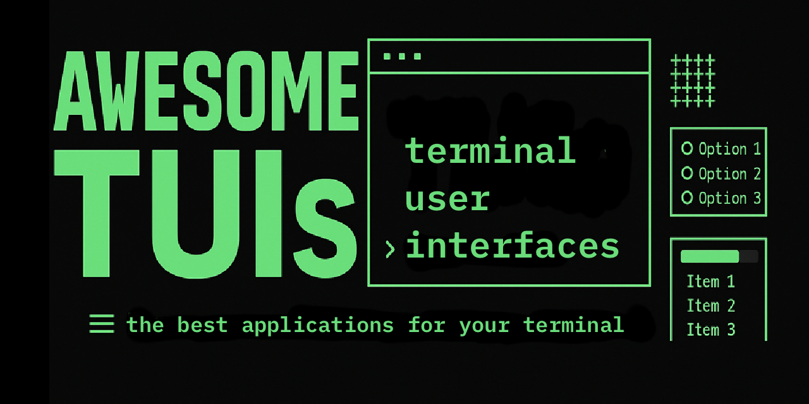

## Table of Contents

- [Dashboards](#dashboards)
- [Development](#development)
- [Docker/Containers/K8s](#dockerlxck8s)
- [Editors](#editors)
- [File Managers](#file-managers)
- [Games](#games)
- [Libraries](#libraries)
- [Messaging](#messaging)
- [Miscellaneous](#miscellaneous)
- [Multimedia](#multimedia)
- [Productivity](#productivity)
- [Web](#web)

<h2>Dashboards</h2>

- [AdGuardian-Term](https://github.com/lissy93/AdGuardian-Term) A TUI dashboard for monitoring real-time traffic from an AdGuard Home instance
- [apachetop](https://github.com/tessus/apachetop) display information from a running copy of Apache.
- [bandwhich](https://github.com/imsnif/bandwhich) Terminal bandwidth utilization tool
- [bashtop](https://github.com/aristocratos/bashtop) Resource manager written in bash
- [below](https://github.com/facebookincubator/below) A time traveling resource monitor for modern Linux systems
- [binsider](https://github.com/orhun/binsider) A TUI for analyzing Linux binaries.
- [bmon](https://github.com/tgraf/bmon) A monitoring and debugging tool to capture networking related statistics and prepare them visually.
- [bottom](https://github.com/ClementTsang/bottom) A customizable graphical process/system monitor for the terminal.
- [bpytop](https://github.com/aristocratos/bpytop) A Python-based system monitor with lots of information.
- [btop++](https://github.com/aristocratos/btop) Resource monitor with extras
- [cgdb](https://github.com/cgdb/cgdb) Console front-end to the GNU debugger
- [chdig](https://github.com/azat/chdig) Dig into ClickHouse with TUI interface
- [cheatshh](https://github.com/AnirudhG07/cheatshh) A fzf TUI for managing custom made command-line cheatsheet for Unix.
- [cointop](https://github.com/miguelmota/cointop) The fastest and most interactive terminal based UI application for tracking cryptocurrencies
- [CoreFreq](https://github.com/cyring/CoreFreq) CPU monitoring software designed for the 64-bits Processors
- [damon](https://github.com/hashicorp/damon) TUI interface for Hashicorp Nomad
- [dashbrew](https://github.com/rasjonell/dashbrew) TUI dashboard builder that lets you visualize data from scripts and APIs.
- [dolphie](https://github.com/charles-001/dolphie) Your single pane of glass for real-time analytics into MySQL/MariaDB & ProxySQL
- [fubar](https://github.com/irishmaestro/fubar) Formidable Unix Binary Arsenal & Repository. TUI built for gtfobins power users.
- [Glances](https://github.com/nicolargo/glances) Glances an Eye on your system. A top/htop alternative.
- [Goaccess](https://github.com/allinurl/goaccess) GoAccess is a real-time web log analyzer and interactive viewer that runs in a terminal in nix systems or through your browser.
- [gobang](https://github.com/TaKO8Ki/gobang) A cross-platform TUI database management tool written in Rust
- [gonzo](https://github.com/control-theory/gonzo) A powerful, real-time log analysis terminal UI inspired by k9s.
- [gotop](https://github.com/xxxserxxx/gotop) A terminal based graphical activity monitor inspired by gtop and vtop
- [gping](https://github.com/orf/gping) Ping, but with a graph
- [Grafterm](https://github.com/slok/grafterm) Metrics dashboards on terminal, a Grafana inspired terminal version
- [htop](https://github.com/htop-dev/htop) Interactive text-mode process viewer for Unix systems. It aims to be a better 'top'
- [htui](https://github.com/PierreKieffer/htui) Heroku Terminal User Interface
- [hwinfo-tui](https://github.com/JuanjoFuchs/hwinfo-tui) A gping-inspired terminal visualization tool for monitoring real-time hardware sensor data from HWInfo
- [kaskade](https://github.com/sauljabin/kaskade) TUI for kafka, which allows you to interact and consume topics from your terminal in style!
- [kmon](https://github.com/orhun/kmon) Linux Kernel Manager and Activity Monitor
- [Kyanos](https://github.com/hengyoush/kyanos) Linux network analysis tool based on eBPF
- [macmon](https://github.com/vladkens/macmon) Sudoless performance monitoring for Apple Silicon processors written in Rust
- [nerdlog](https://github.com/dimonomid/nerdlog) fast, remote-first, multi-host TUI log viewer
- [nethogs](https://github.com/raboof/nethogs) 'net top' tool
- [netscanner](https://github.com/Chleba/netscanner) Network scanner
- [nvtop](https://github.com/Syllo/nvtop) GPUs process monitoring for AMD, Intel and NVIDIA
- [oryx](https://github.com/pythops/oryx) A TUI for sniffing network traffic using eBPF
- [otel-tui](https://github.com/ymtdzzz/otel-tui) A terminal OpenTelemetry viewer
- [Planor](https://github.com/mrusme/planor) The Cloud Aviator, dashboard for AWS, Vultr, Heroku, ...
- [process-compose](https://github.com/F1bonacc1/process-compose) TUI for running apps and processes
- [Puffin](https://github.com/siddhantac/puffin) A beautiful terminal dashboard for hledger
- [Raijin](https://github.com/MasonStooksbury/Raijin) A free, simple weather TUI that pulls data without the need for an API key, account, or subscription
- [s-tui](https://github.com/amanusk/s-tui) CPU stress and monitoring utility
- [sockttop](https://github.com/jasonwitty/socktop) socktop is a remote system monitor with a rich TUI, inspired by top/btop, talking to a lightweight agent over WebSockets.
- [sysz](https://github.com/joehillen/sysz) An fzf terminal UI for systemctl
- [talos linux](https://github.com/siderolabs/talos) A Linux distro with a TUI dashboard for local and remote usage
- [tdash](https://github.com/jessfraz/tdash) A terminal dashboard with stats from Google Analytics, GitHub, Travis CI, and Jenkins. Very much built specific to me
- [tegratop](https://github.com/pythops/tegratop) Monitoring tool (top like) for Nvidia jetson boards
- [TermUI](https://github.com/gizak/termui) Golang terminal dashboard
- [trek](https://github.com/franckverrot/trek) ncurses explorer for Hashicorp Nomad clusters
- [trippy](https://github.com/fujiapple852/trippy) A network diagnostic tool that includes functionality like mtr and more
- [ttop](https://github.com/inv2004/ttop) System monitoring tool with historical data service, triggers and top-like TUI
- [tufw](https://github.com/peltho/tufw) Terminal UI for ufw
- [tuicamp](https://github.com/AbeEstrada/tuicamp) Unofficial TimeCamp TUI
- [tmd-top](https://github.com/CDWEN0526/tmd-top)   Used to monitor the process tcp traffic of the linux system, detailed to each IP connection
- [wander](https://github.com/robinovitch61/wander) HashiCorp Nomad terminal client
- [WTF](https://github.com/senorprogrammer/wtf) The personal information dashboard for your terminal.
- [Yozefu](https://github.com/MAIF/yozefu) An TUI for exploring data of a kafka cluster.
- [zenith](https://github.com/bvaisvil/zenith) In terminal graphical metrics for your *nix system written in Rust

---

<h2>Development</h2>

- [act3](https://github.com/dhth/act3) Glance at the last 3 runs of your Github Actions
- [amtui](https://github.com/pehlicd/amtui/) Alertmanager TUI - Your Terminal Companion for Alertmanager
- [ATAC](https://github.com/Julien-cpsn/ATAC) A feature-full TUI API client made in Rust. ATAC is free, open-source, offline and account-less.
- [austin-tui](https://github.com/P403n1x87/austin-tui) The top-like text-based user interface for Austin
- [blinkenlights](https://github.com/jart/blink) TUI that may be used for debugging x86_64-linux or i8086 programs across platforms
- [brows](https://github.com/rubysolo/brows) CLI GitHub release browser
- [burf](https://github.com/razeghi71/burf) TUI for Google Cloud Storage (GCS)
- [cargo-seek](https://github.com/tareqimbasher/cargo-seek) A TUI for searching, adding and installing cargo crates
- [catalyst](https://github.com/PraveenGongada/catalyst) Elegant TUI for triggering GitHub Actions workflows with matrix configurations.
- [cnTUI](https://github.com/fipso/cntui) Replay chrome requests from your terminal using curl
- [chiko](https://github.com/felangga/chiko) The Ultimate Beauty TUI gRPC Client
- [Close Mongo Ops Manager](https://github.com/closeio/close-mongo-ops-manager) Monitor and kill MongoDB operations
- [Cloud Code Usage Monitor](https://github.com/Maciek-roboblog/Claude-Code-Usage-Monitor) Monitor Claude token usage
- [csope](https://github.com/agvxov/csope) C source code browser based on cscope
- [CuTE](https://github.com/PThorpe92/CuTE) TUI to help build, execute and save curl commands, recursively download from remote sources, test your API endpoints, and mange your keys
- [crush](https://github.com/charmbracelet/crush) The glamourous AI coding agent
- [dbee](https://github.com/murat-cileli/dbee) Fast & Minimalistic Database Browser
- [dblab](https://github.com/danvergara/dblab) The database client every command line junkie deserves
- [ddqa](https://github.com/DataDog/ddqa) Jira TUI to help with software releases
- [delta](https://github.com/dandavison/delta) A syntax-highlighting pager for git, diff, and grep output
- [Froggit](https://github.com/thewizardshell/froggit) Minimalist Git TUI with GitHub CLI integration
- [euporie](https://github.com/joouha/euporie) Jupyter notebooks in the terminal
- [fx](https://github.com/antonmedv/fx) Terminal JSON viewer & processor
- [ggc](https://github.com/bmf-san/ggc) A terminal-based Git CLI tool written in Go
- [gitui](https://github.com/extrawurst/gitui) blazing fast terminal-ui for git written in rust
- [git-crecord](https://github.com/andrewshadura/git-crecord) interactive selective commit tool
- [grv](https://github.com/rgburke/grv) Terminal interface for viewing git repositories
- [harlequin](https://github.com/tconbeer/harlequin) The SQL IDE for Your Terminal
- [jqp](https://github.com/noahgorstein/jqp) A TUI playground to experiment with jq
- [lazygit](https://github.com/jesseduffield/lazygit) Simple terminal UI for git commands
- [lazysql](https://github.com/jorgerojas26/lazysql) A cross-platform TUI database management tool written in Go.
- [lazyjournal](https://github.com/Lifailon/lazyjournal) TUI for journalctl, file system logs, as well Docker and Podman containers for quick viewing and filtering
- [logshark](https://github.com/ugosan/logshark) A debugger CLI for JSON logs written in Go
- [mitmproxy](https://www.mitmproxy.org) A free and open source interactive HTTPS proxy
- [nap](https://github.com/maaslalani/nap) Code snippets in your terminal
- [nodebro](https://github.com/jonaburg/nodebro) Easily view most recent Github releases/tags and release notes from the terminal
- [opencode](https://github.com/sst/opencode) AI coding agent, built for the terminal
- [play](https://github.com/paololazzari/play) A TUI playground to experiment with your favorite programs, such as grep, sed, awk, jq and yq
- [posting](https://github.com/darrenburns/posting) A powerful HTTP client that lives in your terminal
- [pproftui](https://github.com/Oloruntobi1/pproftui) A terminal-based UI for Go's pprof that makes profiling interactive
- [proxymock](https://proxymock.io) A network recorder that shows API payloads in a TUI and automatically generates tests and mocks from what it observes.
- [prs](https://github.com/dhth/prs) Stay updated on PRs without leaving the terminal
- [pudb](https://github.com/inducer/pudb) A console-based visual debugger for Python
- [pyautogit](https://github.com/jwlodek/pyautogit) A terminal UI for managing git repositories, written using py_cui
- [rainfrog](https://github.com/achristmascarl/rainfrog) A database management TUI for Postgres, MySQL, and SQLite written in Rust
- [runme](https://github.com/stateful/runme) Discover and run code snippets directly from your README.md or other markdowns
- [sls-dev-tools](https://github.com/Theodo-UK/sls-dev-tools) Dev Tools for the Serverless World
- [stu](https://github.com/lusingander/stu) A TUI for Amazon S3
- [termdbms](https://github.com/mathaou/termdbms) A TUI for viewing and editing database files.
- [terraform-tui](https://github.com/idoavrah/terraform-tui) view and interact with Terraform state
- [toolui](https://github.com/jinek/ToolUI) Dotnet core application to manage installed nuget tools
- [tokui](https://github.com/zdyxry/tokui) An interactive TUI for visualizing code statistics from tokei.
- [soft-serve](https://github.com/charmbracelet/soft-serve) A tasty, self-hostable Git server for the command lineicecream
- [tig](https://github.com/jonas/tig) Text-mode interface for git
- [vctui](https://github.com/thebsdbox/vctui) Console interface for vCenter
- [violet](https://github.com/braheezy/violet) Colorful TUI frontend to run Vagrant commands

---

<h2>Docker/LXC/K8s</h2>

- [ctop](https://github.com/bcicen/ctop) Top-like interface for container metrics
- [dive](https://github.com/wagoodman/dive) A tool for exploring each layer in a docker image
- [dockly](https://github.com/lirantal/dockly) Immersive terminal interface for managing docker containers and services
- [dry](https://github.com/moncho/dry) A Docker manager for the terminal
- [ducker](https://github.com/robertpsoane/ducker) A slightly quackers Docker TUI based on k9s
- [e1s](https://github.com/keidarcy/e1s) TUI for managing AWS ECS resources
- [eks-node-viewer](https://github.com/awslabs/eks-node-viewer/) visualizing dynamic node usage within a kubernetes cluster
- [k9s](https://github.com/derailed/k9s) TUI for managing a Kubernetes cluster
- [kdash](https://github.com/kdash-rs/kdash) A simple and fast dashboard for Kubernetes
- [kftui](https://github.com/hcavarsan/kftray) - A TUI to manage multiple kubectl port-forward commands, with support for UDP and K8s proxy.
- [ktop](https://github.com/vladimirvivien/ktop) A top-like tool for your Kubernetes clusters
- [kubetui](https://github.com/sarub0b0/kubetui) A TUI tool designed for monitoring Kubernetes resources.
- [lazycontainer](https://github.com/andreybleme/lazycontainer) TUI for managing Apple containers
- [lazydocker](https://github.com/jesseduffield/lazydocker) The lazier way to manage everything docker
- [oxker](https://github.com/mrjackwills/oxker) A simple tui to view & control docker containers
- [Pocker](https://github.com/pommee/Pocker) TUI based application for docker related tasks.
- [Podman-tui](https://github.com/containers/podman-tui) TUI for Podman containers
- [sen](https://github.com/TomasTomecek/sen) Terminal User Interface for docker engine

---

<h2>Editors</h2>

- [amp](https://github.com/jmacdonald/amp) A complete text editor for your terminal
- [C-Edit](https://github.com/velorek1/c-edit) A text editor with drop down menus in the style of MS-DOS Editor
- [Durdraw](https://github.com/cmang/durdraw) An ASCII, Unicode and ANSI art editor
- [Edit](https://github.com/microsoft/edit) A simple text editor. Pays homage to the classic MS-DOS Editor.
- [helix](https://helix-editor.com/) A post-modern text editor.
- [frogmouth](https://github.com/Textualize/frogmouth) A Markdown browser for your terminal
- [kakoune](http://kakoune.org/) A modern, modal text editor with focus on interactivity and efficiency
- [maki](https://sr.ht/~bscit/maki/) A simple tabbed text editor with file navigation and an emphasis on preserving battery life
- [micro](https://github.com/zyedidia/micro) A modern and intuitive terminal-based text editor
- [orbiton](https://github.com/xyproto/orbiton) Text editor limited by VT100, suitable for programming, writing git commit messages and editing Markdown
- [slap](https://github.com/slap-editor/slap) Sublime-like terminal-based text editor
- [tilde](https://github.com/gphalkes/tilde) Intuitive text editor for the terminal
- [thymus](https://github.com/blademd/thymus) An interactive browser & editor for network configuration files.
- [turbo](https://github.com/magiblot/turbo) An experimental text editor for the terminal, based on Scintilla and Turbo Vision
- [vis](https://github.com/martanne/vis) A vi-like editor based on Plan 9's structural regular expressions
- [zee](https://github.com/zee-editor/zee) A modern text editor for the terminal written in Rust

---

<h2>File Managers</h2>

- [adbtuifm](https://github.com/darkhz/adbtuifm) A TUI file manager for Android, based on the Android Debug Bridge(ADB).
- [broot](https://github.com/Canop/broot) A new way to see and navigate directory trees
- [far2l](https://github.com/elfmz/far2l) Linux port of Far v2 file manager
- [fml](https://github.com/wick3dr0se/fml) :file_folder: A stupid simple, fast file manager written in BASH v4.2+.
- [goful](https://github.com/anmitsu/goful) a powerful TUI file manager written in Go.
- [lf](https://github.com/gokcehan/lf) A terminal file manager written in Go with heavy inspiration from ranger file manager.
- [mc](https://github.com/MidnightCommander/mc) GNU Midnight Commander. A free cross-platform orthodox file manager.
- [nnn](https://github.com/jarun/nnn) n³ The unorthodox terminal file manager.
- [ntc](https://codeberg.org/ItsZariep/ntc) Ncurses Tabbed file Chooser.
- [ranger](https://github.com/ranger/ranger) A VIM-inspired file manager for the console.
- [sfm](https://github.com/afify/sfm) Simple file manager.
- [superfile](https://github.com/MHNightCat/superfile) Pretty fancy and modern terminal file manager.
- [TUIFIManager](https://github.com/GiorgosXou/TUIFIManager) A cross-platform terminal-based file manager *(supports termux)*.
- [Vifm](https://github.com/vifm/vifm) A TUI file manager with vi-keybindings and other vim like behaviour.
- [yazi](https://github.com/sxyazi/yazi) Blazing fast terminal file manager written in Rust, based on async I/O.

---

<h2>Games</h2>

- [2048-cli](https://github.com/tiehuis/2048-cli) The game 2048 for your Linux terminal
- [awkaster](https://github.com/TheMozg/awk-raycaster) Pseudo-3D shooter written completely in gawk using raycasting technique
- [balatrotui](https://github.com/Passeriform/BalatroTUI) A TUI clone of Balatro
- [bastet](https://github.com/fph/bastet) Evil falling block game
- [botany](https://github.com/jifunks/botany/) Virtual plant buddy
- [brickgame-4bit](https://github.com/ilyakurdyukov/brickgame-4bit) Brick Game emulator (4-bit Holtek chip)
- [BrogueCE](https://github.com/tmewett/BrogueCE) Beautiful roguelike dungeon crawler
- [cbonsai](https://gitlab.com/jallbrit/cbonsai) A bonsai tree generator
- [chess-tui](https://github.com/thomas-mauran/chess-tui) Play Chess in your terminal, built in rust
- [clidle](https://github.com/ajeetdsouza/clidle) Play Wordle in your terminal. Also works over SSH!
- [csol](https://github.com/nielssp/csol) Collection of solitaire/patience games, such as Klondike, FreeCell, Spider, and Yukon
- [DOOM-ASCII](https://github.com/wojciech-graj/doom-ascii) Text-based DOOM running in terminal.
- [Gameboy Emulator](https://github.com/gabrielrcouto/php-terminal-gameboy-emulator) A PHP Terminal GameBoy Emulator
- [go-life](https://github.com/sachaos/go-life) Terminal based Conway's Game of Life
- [Greed](https://gitlab.com/esr/greed) A game of consumption. Eat as much as you can before munching yourself into a corner!
- [MAL-Cli](https://github.com/L4z3x/mal-tui) A terminal interface for the official myanimelist api written in rust.
- [Maze TUI](https://github.com/agl-alexglopez/maze-tui) Build mazes and solve them with various algorithms.
- [Micro Snake](https://github.com/troglobit/snake) A small snake game, utilizing ANSI escape sequences to draw the board.
- [Micro Tetris](https://github.com/troglobit/tetris) One of the smallest Tetris implementations in the world, utilizing only ANSI escape sequences to draw the board.
- [moon-buggy](https://github.com/seehuhn/moon-buggy) Drive some car across the moon
- [MyMan](https://sourceforge.net/projects/myman/) MyMan is a video game for color and monochrome text terminals in the genre of Namco's Pac-Man
- [nchess](https://github.com/billyvinning/nchess) Chess in the terminal, written in C.
- [NetHack](https://github.com/NetHack/NetHack) Dungeon exploration game
- [nInvaders](http://ninvaders.sourceforge.net/) Space Invaders
- [nSnake](https://github.com/alexdantas/nSnake) The classic snake game with textual interface
- [nudoku](https://github.com/jubalh/nudoku) ncurses based sudoku game
- [onx](https://github.com/vyalovvldmr/onx) Noughts & Crosses client-server game with your partner. Based on textual and python.
- [pokete](https://github.com/lxgr-linux/pokete) A terminal based Pokemon like game
- [Rebels in the sky](https://github.com/ricott1/rebels-in-the-sky) P2P terminal game about spacepirates playing basketball across the galaxy.
- [snake](https://github.com/wick3dr0se/snake) :video_game:  A super minimal TUI snake game written in pure BASH v5.1+
- [Square Tic Tac Toe](https://github.com/learnbyexample/TUI-apps/tree/main/SquareTicTacToe) Like Tic Tac Toe, but form a square with 4 corners instead of a line
- [ssHattrick](https://github.com/ricott1/sshattrick) Play Hattrick in your terminal over SSH.
- [sshtron](https://github.com/zachlatta/sshtron) multiplayer lightcycle game that runs through SSH
- [sssnake](https://github.com/AngelJumbo/sssnake) The classic snake game for the terminal that can play itself and be used like a screensaver.
- [steam-tui](https://github.com/dmadisetti/steam-tui) Just a simple TUI client for steamcmd. Allows for the graphical launching, updating, and downloading of steam games through a simple terminal client.
- [sudoku-rs](https://github.com/MitchelPaulin/sudoku-rs) Sudoku built with tui-rs
- [sweeper](https://github.com/igor47/sweeper) Minesweeper game using curtsies
- [terminal-phase](https://gitlab.com/dustyweb/terminal-phase) Space shooter game that runs in your terminal!
- [tinytetris](https://github.com/taylorconor/tinytetris) 80x23 terminal tetris!
- [tty-solitaire](https://github.com/mpereira/tty-solitaire) Solitaire runs in your terminal!
- [typeinc](https://github.com/AnirudhG07/Typeinc) ncurses based typing speed test with various difficulty levels.
- [typing-game-cli](https://github.com/akgondber/typing-game-cli) Command line game to practice your typing speed by competing against typer-robot or against your best result
- [wocogo](https://codeberg.org/kedlubnowski/wocogo) Construct words from a list of given segments. A simple TUI game in Python, similar to the NY Times Combinations game.
- [Wordle](https://github.com/m-dango/raku-wordle/) Script and library for Wordle, written in Raku
- [Zigtris](https://github.com/ringtailsoftware/zigtris) YA terminal tetris
- [Zoridor](https://github.com/ringtailsoftware/zoridor) Play Quoridor in the terminal

---

<h2>Libraries</h2>

- [AnbUI](https://github.com/oerg866/anbui) A minimal Text UI Library in **C**
- [Argenta](https://github.com/koloideal/Argenta) Library for building modular applications **Python**
- [ASCII_Board_Game_Engine](https://github.com/tjunruh/ASCII_Board_Game_Engine) A graphics engine for making board games in **C++**
- [Ashen](https://github.com/colinta/Ashen) An Elm inspired framework written in **Swift**
- [blessed](https://github.com/chjj/blessed) A high-level terminal interface library for **Node.js**
- [blessed](https://github.com/jquast/blessed) Blessed is an easy, practical library for making **Python** terminal apps
- [blessings](https://github.com/erikrose/blessings) A **Python** wrapper lib for ncurses that makes your code pretty to look at
- [bubbletea](https://github.com/charmbracelet/bubbletea) A **Go** framework based on Elm to build functional and stateful TUI apps, complete with extensions known as [bubbles](https://github.com/charmbracelet/bubbles)
- [CursedGL](https://github.com/saccharineboi/CursedGL) A **C** notcurses-based software rasterizer inspired by OpenGL 1.X that renders directly to the terminal.
- [ConsoleCraftEngine](https://github.com/ural89/ConsoleCraftEngine) A terminal-based 2D game engine written in **C++**.
- [Consolonia](https://github.com/jinek/Consolonia) Dotnet core terminal-based GUI framework with support of XAML
- [FINAL CUT](https://github.com/gansm/finalcut) **C++** library for creating terminal applications with text-based widgets
- [FTXUI](https://github.com/ArthurSonzogni/FTXUI) 💻 **C++** Functional Terminal User Interface. ❤️
- [gocui](https://github.com/jroimartin/gocui) Minimalist **Go** package aimed at creating Console User Interfaces
- [gum](https://github.com/charmbracelet/gum) A tool for glamorous **shell** scripts
- [imtui](https://github.com/ggerganov/imtui) An immediate mode text-based user interface **C++** library, supporting 256 ANSI colors and mouse/keyboard input.
- [ink](https://github.com/vadimdemedes/ink) React for **Node.js** interactive command-line apps
- [iocraft](https://github.com/ccbrown/iocraft) **Rust** crate for beautiful, artisanally crafted TUIs and text-based IO, with a declarative, React-like API inspired by Ink.
- [Lanterna](https://github.com/mabe02/lanterna) A **Java** library for creating text-based UIs, very similar to the C library curses but with more functionality.
- [moulti](https://moulti.run/) A CLI-driven TUI displaying arbitrary outputs inside visual, collapsible blocks. Designed with **shell** scripts in mind. **Ansible**-friendly too.
- [ncurses](https://invisible-island.net/ncurses/announce.html) A classic **C** library with bindings for many languages
- [nimwave](https://github.com/ansiwave/nimwave) Build text interfaces for the terminal or browser in **Nim**
- [notcurses](https://github.com/dankamongmen/notcurses) blingful character graphics/TUI library for **C** and **Python**. definitely not curses.
- [php-tui](https://github.com/php-tui/php-tui) comprehensive TUI library for **PHP** based heavily on Ratatui.
- [pterm](https://github.com/pterm/pterm/) A modern **Go** module to beautify console output. Featuring charts, progressbars, tables, trees, and much more! It's completely configurable and 100% cross-platform compatible.
- [py_cui](https://github.com/jwlodek/py_cui) **Python** library aimed at making widget based TUI/CUI interfaces as simple as possible. Supports standard widgets and popups like menus, textboxes, forms, file explorers etc.
- [pytermgui](https://github.com/bczsalba/pytermgui) A simple yet powerful TUI framework for your **Python** (3.7+) applications.
- [pyTermTk](https://github.com/ceccopierangiolieugenio/pyTermTk) self-contained TUI library for **Python** with a QT-like API semantics
- [Python Prompt Toolkit](https://github.com/prompt-toolkit/python-prompt-toolkit) Library for building powerful interactive command line applications in **Python**
- [rang](https://github.com/agauniyal/rang) A Minimal, Header only Modern **C++** library for terminal goodies
- [Ratatui](https://github.com/tui-rs-revival/ratatui) A **Rust** crate for building Terminal UIs (actively maintained fork of tui-rs).
- [Rich](https://github.com/willmcgugan/rich) is a **Python** library for rich text and beautiful formatting in the terminal.
- [Spectre.Console](https://github.com/spectreconsole/spectre.console) A **.NET** library for creating beautiful console applications
- [stickers](https://github.com/76creates/stickers) Building blocks for charmbracelet/lipgloss in **Go**
- [tcell](https://github.com/gdamore/tcell) Tcell is an alternate **Go** terminal package, similar in some ways to termbox, but better in others.
- [termbox2](https://github.com/termbox/termbox2) A terminal rendering library for creating TUIs.
- [textual](https://github.com/willmcgugan/textual) is a TUI (Text User Interface) framework for **Python** inspired by modern web development.
- [Thermage](https://github.com/thermage/thermage) Thermage is a **PHP** library that provides a fluent and incredibly powerful, object-oriented interface for customizing CLI output text color, background, formatting, theming and more.
- [TermGL](https://github.com/wojciech-graj/TermGL) A terminal-based graphics library for 2D and 3D graphics.
- [termdb](https://github.com/agauniyal/termdb) Terminfo parser for modern **C++**
- [Terminal.Gui](https://github.com/gui-cs/Terminal.Gui) Cross-platform terminal UI toolkit for **.NET**
- [tui-input](https://github.com/sayanarijit/tui-input) TUI input library supporting multiple backends, tui-rs and ratatui
- [tui-go](https://github.com/marcusolsson/tui-go) A **Go** UI library for terminal applications (deprecated)
- [tui-rs](https://github.com/fdehau/tui-rs) Terminal user interfaces and dashboards using **Rust** (no longer maintained, use Ratatui instead).
- [tuibox](https://github.com/Cubified/tuibox) A single-header **C** terminal UI library, capable of creating mouse-driven, interactive applications on the command line.
- [Tui Widgets](https://github.com/tuiwidgets/tuiwidgets) A high-level widget based toolkit for terminal applications.
- [tview](https://github.com/rivo/tview/) Terminal UI library with rich, interactive widgets — written in **Go**
- [tvision](https://github.com/magiblot/tvision) A modern port of **C++** Turbo Vision 2.0, cross-platform and Unicode support.
- [UniCurses](https://github.com/unicurses/unicurses) A **Python** module that is aimed at providing the Curses functionality on all operating systems.
- [urwid](https://github.com/urwid/urwid) A console user interface library for **Python** on Linux, OSX, Cygwin or other unix-like OS.
- [libuv](https://github.com/libuv/libuv) Cross-platform asynchronous I/O library - written in **C**
- [uvw](https://github.com/skypjack/uvw) Header-only, event based, tiny and easy to use libuv wrapper in modern **C++** - now available as also shared/static library!
- [xtd](https://github.com/gammasoft71/xtd) Free open-source modern **C++** framework to create console (CLI), forms (GUI like WinForms) and unit test (xUnit) applications and libraries on Windows, macOS, Linux, iOS, Android, FreeBSD, and Haiku.

---

<h2>Messaging</h2>

- [aerc](https://aerc-mail.org/) Email client
- [alpine](https://alpineapp.email/) Email client
- [basalt](https://github.com/erikjuhani/basalt) TUI Application to manage Obsidian vaults and notes directly from the terminal.
- [blitzdenk](https://github.com/Lommix/blitzdenk) A minimal multi api auto-context project chat bot as tui
- [Devzat](https://github.com/quackduck/devzat) Chat over SSH, written in Golang with self-hosting ability.
- [discordo](https://github.com/ayntgl/discordo) A lightweight, secure, and feature-rich Discord terminal client
- [endcord](https://github.com/mzivic7/endcord) Feature rich Discord TUI client.
- [Gomphotherium](https://github.com/mrusme/gomphotherium) A command line Mastodon client.
- [gomuks](https://github.com/tulir/gomuks) Matrix client
- [gurk-rs](https://github.com/boxdot/gurk-rs) Signal Messenger client for terminal
- [instagram-cli](https://github.com/supreme-gg-gg/instagram-cli) Use Instagram from your terminal, the end of brainrot is here
- [irssi](https://irssi.org/) An IRC terminal client
- [mastui](https://github.com/kimusan/mastui) Mastodon TUI
- [matterhorn](https://github.com/matterhorn-chat/matterhorn) A Mattermost terminal client.
- [mcabber](https://mcabber.com/) XMPP (Jabber) client
- [meli](https://meli.delivery/) Email client
- [Mutt](https://gitlab.com/muttmua/mutt) Email client
- [nchat](https://github.com/d99kris/nchat) Telegram/WhatsApp client
- [nomadnet](https://github.com/markqvist/NomadNet) Secure messaging network built on Reticulum
- [nostui](https://github.com/akiomik/nostui) Nostr client
- [nostratui](https://github.com/adamm-xyz/nostratui) A terminal user interface (TUI) for browsing Nostr posts, written in Rust.
- [Profanity](https://profanity-im.github.io) XMPP (Jabber) client
- [sclack](https://github.com/haskellcamargo/sclack) Slack terminal client
- [scli](https://github.com/isamert/scli/) A simple terminal user interface for signal messenger
- [siggo](https://github.com/derricw/siggo) A terminal ui for signal-cli, written in Go
- [Slack-term](https://github.com/erroneousboat/slack-term) Slack client for your terminal
- [sup](https://github.com/sup-heliotrope/sup) A curses threads-with-tags style email client
- [Superhighway84](https://github.com/mrusme/superhighway84) USENET-inspired decentralized internet discussion system
- [tgt](https://github.com/FedericoBruzzone/tgt) A TUI for Telegram written in Rust
- [toot](https://github.com/ihabunek/toot) Mastodon CLI & TUI
- [tuisky](https://github.com/sugyan/tuisky) TUI client for BlueSky
- [tuix](https://github.com/pythops/tuix) TUI for managing screens
- [tut](https://github.com/RasmusLindroth/tut) Mastodon TUI client
- [twitch-tui](https://github.com/Xithrius/twitch-tui) Twitch chat in the terminal
- [Weechat](https://weechat.org/) Extensible chat client
- [zulip-terminal](https://github.com/zulip/zulip-terminal) Official Zulip terminal client (similar to matterhorn)

---

<h2>Miscellaneous</h2>

- [arttime](https://github.com/reportaman/arttime) An app that brings beauty of text-art together with functionality of clock, timer, and pattern-based time manager.
- [asciiMol](https://github.com/dewberryants/asciiMol) Curses based ASCII molecule viewer for linux terminals.
- [bluetuith](https://github.com/darkhz/bluetuith) A TUI-based bluetooth connection manager, which can interact with bluetooth adapters and devices.
- [bluetui](https://github.com/pythops/bluetui) A TUI for managing bluetooth devices.
- [Caligula](https://github.com/ifd3f/caligula) A user-friendly, lightweight TUI for imaging disks.
- [Captain's log](https://github.com/NikolaDucak/caps-log) A small TUI journaling tool
- [cava](https://github.com/karlstav/cava) Cross-platform Audio Visualizer
- [cfdisk](https://github.com/util-linux/util-linux) TUI partition editor included in util-linux
- [cgdisk](https://www.rodsbooks.com/gdisk/cgdisk-walkthrough.html) TUI partition editor for manipulating GUID partition tables, and modeled after cfdisk
- [csvlens](https://github.com/YS-L/csvlens) TUI CSV file viewer. It is like less but made for CSV.
- [diary](https://github.com/actuday6418/Diary) A diary app written in Rust that encrypts both text and file data, and can decrypt and build a rich HTML representation of your diary when required.
- [DigiSurf](https://github.com/SeanMcLoughlin/digisurf) A TUI signal waveform viewer
- [diskonaut](https://github.com/imsnif/diskonaut) Terminal disk space navigator
- [distrobox-tui](https://github.com/hyperreal64/distrobox-tui) TUI for managing distrobox containers
- [ec2-instance-selector](https://github.com/aws/amazon-ec2-instance-selector) A CLI tool and go library which recommends instance types based on resource criteria like vcpus and memory
- [emu2](https://github.com/dmsc/emu2) A simple DOS emulator for the Linux text console, supporting basic DOS system calls and console I/O.
- [flawz](https://github.com/orhun/flawz) A Terminal UI for browsing security vulnerabilities (CVEs)
- [fnf](https://github.com/leo-arch/fnf) An interactive fuzzy finder for the terminal
- [fzf](https://github.com/junegunn/fzf) A general-purpose command-line fuzzy finder
- [gdu](https://github.com/dundee/gdu) Fast disk usage analyzer with console interface written in Go
- [gif-for-cli](https://github.com/google/gif-for-cli) Convert a gif into ASCII
- [godap](https://github.com/Macmod/godap) A complete TUI for LDAP written in Golang
- [gpg-tui](https://github.com/orhun/gpg-tui) A terminal user interface for GnuPG
- [HumBLE Explorer](https://github.com/koenvervloesem/humble-explorer) A cross-platform, command-line and human-friendly Bluetooth Low Energy scanner
- [IconicFonts](https://github.com/iconicFonts/iconic-fonts) A collection of patched fonts featuring over 60,000 icons, tailored specifically for TUIs.
- [impala](https://github.com/pythops/impala) TUI for managing wifi
- [isw](https://gitlab.com/thom-cameron/isw) A simple terminal stopwatch application for pomodoro etc.
- [jrnl](https://jrnl.sh/) Collect your thoughts and notes without leaving the command line. human-friendly. future-proof. secure.
- [LearnByExample](https://github.com/learnbyexample/TUI-apps) A TUI with tutorials and +300 exercises on python, grep, awk, sed & general terminal usage.
- [lnav](https://lnav.org/) An advanced log file viewer for the small-scale
- [mapscii](https://github.com/rastapasta/mapscii) Braille & ASCII world map renderer for your console
- [mqttui](https://github.com/EdJoPaTo/mqttui) MQTT Client written in rust
- [moc](https://moc.daper.net/download) console audio player
- [moribito](https://github.com/ericschmar/moribito) Browse LDAP directory trees, viewing records, and executing custom queries.
- [neoss](https://github.com/PabloLec/neoss) Socket statistics visualization and explanation tool for Unix systems.
- [nmtui](https://developer.gnome.org/NetworkManager/stable/nmtui.html) ncurses network manager
- [oha](https://github.com/hatoo/oha) HTTP load generator
- [packemon](https://github.com/ddddddO/packemon) Packet generator and monitor.
- [PesterExplorer](https://github.com/HeyItsGilbert/PesterExplorer) A TUI to explore Pester results.
- [pola](https://github.com/Sethispr/pola) A TUI for efficiently searching skins, checking values and finding owners in Silent Assassin.
- [pug](https://github.com/leg100/pug) terraform and tofu module and infrastructure management.
- [profanity](https://github.com/profanity-im/profanity) A cross-platfrom XMPP client.
- [physics-TUI](https://github.com/ClaudioRMalvino/physics_TUI) Physics TUI application for undergraduate study
- [ncdu](https://dev.yorhel.nl/ncdu) disk usage analyzer with an ncurses interface
- [nemu](https://github.com/nemuTUI/nemu) A TUI for QEMU
- [recoverpy](https://github.com/PabloLec/recoverpy) A TUI to recover overwritten or deleted data.
- [rocket.term](https://github.com/gerstner-hub/rocket.term) Text based chat client for the Rocket.chat messaging solution.
- [steam_friends_list_tui](https://github.com/AdamWHY2K/steam_friends_list_tui) The steam friends list in the commandline
- [tcpterm](https://github.com/sachaos/tcpterm) tcpterm is a packet visualizer in TUI.
- [tab-pal](https://github.com/ben-n93/tab-pal) Add and edit custom colour palettes in Tableau from the command-line.
- [terminalperiodictable](https://github.com/velorek1/terminalperiodictable) A beautiful TUI periodic table for Unix systems coded in C.
- [termshark](https://github.com/gcla/termshark) Terminal UI for tshark
- [thokr](https://github.com/coloradocolby/thokr) a sleek typing tui written in rust
- [tlock](https://github.com/eklairs/tlock) Two-Factor Authentication Tokens Manager in Terminal
- [tray-tui](https://github.com/Levizor/tray-tui) System tray in your terminal
- [ttyper](https://github.com/max-niederman/ttyper) Terminal-based typing test
- [tui-shop](https://github.com/Gcat101/tui-shop) Something between a CLI and a GUI way of downloading TUIs/CLIs
- [tweakcc](https://github.com/Piebald-AI/tweakcc) TUI to customize your Claude Code themes, thinking verbs, and more.
- [typtea](https://github.com/ashish0kumar/typtea) Minimal terminal-based typing speed tester with support for dozens of programming languages.
- [wb](https://github.com/MertGunduz/wb) A TUI vocabulary notebook app for Linux based devices.
- [wego](https://github.com/schachmat/wego) Weather app
- [wavemon](https://github.com/uoaerg/wavemon) A wireless device monitoring application
- [WG Commander](https://github.com/andrianbdn/wg-cmd) A TUI for a simple WireGuard VPN setup: peer management, QR codes, setup wizard.
- [wttr.in](https://github.com/chubin/wttr.in) The right way to check the weather
- [xplr](https://github.com/sayanarijit/xplr) A hackable, minimal, fast TUI file explorer, stealing ideas from nnn and fzf.
- [x-cmd](https://github.com/x-cmd/x-cmd) A vast and interesting collection of tools that can then bootstrap lots of other programs / functions in a consistent and structured way.

---

<h2>Multimedia</h2>

- [asak](https://github.com/chaosprint/asak) A cross-platform audio recording/playback TUI.
- [chafa](https://hpjansson.org/chafa/) A powerful utility that converts image data, including animated GIFs, into graphics formats or ANSI/Unicode character art suitable for display in a terminal.
- [cmdpxl](https://github.com/knosmos/cmdpxl) Totally practical command-line image editor
- [cmus](https://cmus.github.io/) A small, fast and powerful console music player for Unix-like operating systems.
- [ctune](https://github.com/An7ar35/ctune) ncurses based internet radio player for Linux.
- [draw](https://github.com/maaslalani/draw) A simple drawing tool in the terminal.
- [fancy-cat](https://github.com/freref/fancy-cat) A Lightweight terminal-based PDF reader with Vim keybindings
- [favicon-editor](https://github.com/xyproto/favicon-editor) Spartan grayscale favicon editor
- [gadacz](https://github.com/rareitems/gadacz) Audiobook player
- [GopherTube](https://github.com/krishnassh/gophertube) A terminal-based YouTube client that scrapes YouTube search results and uses mpv for video playback
- [image-sorter](https://github.com/jgalat/image-sorter) Terminal user interface for sorting images using key bindings written in Rust
- [invidtui](https://github.com/darkhz/invidtui) A TUI Invidious client for Windows, Linux and MacOS, that fetches and plays audio/video from an invidious instance. Supports viewing and playing from playlists and channels as well.
- [jellyfin-tui](https://github.com/dhonus/jellyfin-tui) Jellyfin client
- [kew](https://github.com/ravachol/kew) A terminal music player for Linux
- [line](https://github.com/pd3v/line) Tiny command-line midi sequencer and language for live coding
- [mal-cli](https://github.com/L4z3x/mal-cli) A TUI for myanimelist api.
- [managarr](https://github.com/Dark-Alex-17/managarr) A TUI and CLI for managing your *arr servers
- [manga-tui](https://github.com/josueBarretogit/manga-tui) Terminal-based manga reader and downloader with image rendering support
- [marstui-audio](https://github.com/schooldanlp6/marstui-rustio) A nice audio management Interface, similar to pavucontrol with the benefit of customizing everything
- [mps-youtube](https://github.com/mps-youtube/mps-youtube) Terminal based YouTube player and downloader
- [mpvc](https://github.com/gmt4/mpvc) A mpc-like control interface for mpv
- [nap](https://nap.sourceforge.net/) Linux napster client
- [ncspot](https://github.com/hrkfdn/ncspot) Cross-platform ncurses Spotify client written in Rust
- [pyradio](https://github.com/coderholic/pyradio) TUI web radio player with thousands of stations from around the world
- [RadioGoGo](https://github.com/Zi0P4tch0/RadioGoGo) Go-powered CLI to surf global radio waves via a sleek TUI.
- [roku-cli](https://github.com/winsbe01/roku-cli) A command line TUI remote for Roku
- [rmpc](https://mierak.github.io/rmpc/) A configurable MPD client inspired by ncmpcpp and ranger with album art support via various graphics protocols.
- [sonicradio](https://github.com/dancnb/sonicradio) A stylish TUI radio player making use of Radio Browser API and Bubbletea.
- [soundcloud2000](https://github.com/grobie/soundcloud2000) A terminal client for soundcloud
- [spotify-player](https://github.com/aome510/spotify-player) A Spotify player in the terminal with full feature parity
- [spotui](https://github.com/ceuk/spotui) Spotify client written in Python
- [terminal-yt](https://github.com/jooooscha/terminal-yt) A small newsboat-inspired terminal youtube manager
- [termusic](https://github.com/tramhao/termusic) Music Player TUI written in Rust
- [textual-paint](https://github.com/1j01/textual-paint) MS Paint in your terminal
- [timg](https://github.com/hzeller/timg) A terminal image viewer
- [tizonia-openmax-il](https://github.com/tizonia/tizonia-openmax-il) Command-line cloud music player for Linux with support for Spotify, Google Play Music, YouTube, SoundCloud, Dirble, Plex servers and Chromecast devices
- [Toutui](https://github.com/AlbanDAVID/Toutui) A TUI Audiobookshelf Client for Linux
- [upiano](https://github.com/eliasdorneles/upiano) A Piano in your terminal
- [vlc](https://github.com/videolan/vlc) VLC includes an ncurses interface, `vlc --intf ncurses`
- [ytui-music](https://github.com/sudipghimire533/ytui-music) Listen to music from youtube. Configurable, minimal, lightweight, private & beautiful music client.
- [ytdl-tui](https://github.com/darky/ytdl-tui) TUI for downloading Youtube videos
- [ytfzf](https://github.com/pystardust/ytfzf) A POSIX script that helps you find Youtube videos (without API) or Peertube videos and opens/downloads them using mpv/youtube-dl
- [vv](https://github.com/wolfpld/vv) A terminal image viewer, supporting an extensive range of modern image formats

---

<h2>Productivity</h2>

- [abook](https://abook.sourceforge.io/) TUI addressbook with [mutt](http://www.mutt.org/) integration
- [Bagels](https://github.com/EnhancedJax/Bagels) TUI expense tracker
- [calcure](https://github.com/anufrievroman/calcure) Modern TUI calendar and task manager with minimal and customizable UI.
- [calcurse](https://calcurse.org/) calendar and scheduling application for the command line
- [clipse](https://github.com/savedra1/clipse) TUI-based clipboard manager application
- [dvtm](https://github.com/martanne/dvtm) A terminal multiplexer with dwm like window management
- [elia](https://github.com/darrenburns/elia) A terminal ChatGPT client build with Textual
- [fjira](https://github.com/mk-5/fjira) TUI application for Atlassian Jira
- [Glow](https://github.com/charmbracelet/glow) A markdown reader, designed from the ground up to showcase the elegance and capabilities of TUI.
- [gocheat](https://github.com/Achno/gocheat) A beautiful TUI cheatsheet for keybindings,hotkeys,gestures and aliases
- [hledger-ui](https://github.com/simonmichael/hledger) A fast TUI for browsing double entry bookkeeping data
- [h-m-m](https://github.com/nadrad/h-m-m) Hackers Mind Map
- [hnjobs](https://github.com/mwinters0/hnjobs) Find your next job on Who's Hiring
- [hygg](https://github.com/kruserr/hygg) 📚 Simplifying the way you read. Minimalistic Vim-like TUI document reader.
- [kabmat](https://github.com/PlankCipher/kabmat) TUI program for managing kanban boards with vim-like keybindings
- [kanban-python](https://github.com/Zaloog/kanban-python) Kanban Terminal App written in Python
- [khal](https://github.com/pimutils/khal) A standards based CLI calendar program, able to synchronize with CalDAV servers
- [levite](https://github.com/RauliL/levite) A TUI spreadsheet application that uses an RPN formulas and features a vi-friendly interface
- [mcfly](https://github.com/cantino/mcfly) Intelligent context-aware search engine for your shell history
- [mynav](https://github.com/GianlucaP106/mynav) Workspace and session management for terminal environments
- [multranslate](https://github.com/Lifailon/multranslate) A TUI for translating text in multiple translators simultaneously, with support for translation history and language detection
- [pagerduty-tui](https://github.com/Mk555/pagerduty-tui) Minimalistic terminal UI to manage triggered incidents
- [patat](https://github.com/jaspervdj/patat) Terminal-based presentations using Pandoc
- [pdiary](https://github.com/manipuladordedados/pdiary) A simple terminal diary journal application written in Python with encryption support
- [pkm](https://github.com/wick3dr0se/pkm) A super minimal TUI package manager wrapper written in BASH v4.2+
- [portfolio_rs](https://github.com/MarkusZoppelt/portfolio_rs) A command line tool for managing financial investment portfolios.
- [pream-team](https://github.com/nikoladucak/pream-team/) a TUI utility that helps you keep track of your teams GitHub PRs across multiple repositories
- [presenterm](https://github.com/mfontanini/presenterm) A markdown terminal slideshow tool
- [procmux](https://github.com/napisani/procmux) - a TUI for running multiple commands in parallel in easily switchable terminals
- [productivity-timer](https://github.com/h-sifat/productivity-timer) A command line time tracker application with a sleek TUI.
- [sc-im](https://github.com/andmarti1424/sc-im) An ncurses spreadsheet program for terminal. Reignited version of sc
- [SheetsUI](https://github.com/zaphar/sheetsui) A console based spreadsheet application
- [slides](https://github.com/maaslalani/slides) A terminal based presentation tool, supporting markdown syntax.
- [ssh-slides](https://github.com/ivantsepp/ssh-slides) Terminal-based presentations over SSH
- [Tabiew](https://github.com/shshemi/tabiew) A lightweight app to view and query tabular data files, such as CSV, TSV, and parquet.
- [taskline](https://github.com/perryrh0dan/taskline) Tasks, boards & notes for the command-line habitat
- [taskwarrior-tui](https://github.com/kdheepak/taskwarrior-tui) A Terminal User Interface for Taskwarrior
- [television](https://github.com/alexpasmantier/television) A fast and versatile fuzzy finder TUI
- [tenere](https://github.com/pythops/tenere) A TUI for ChatGPT written in Rust.
- [termscp](https://github.com/veeso/termscp) A TUI file transfer and explorer, with support for SCP/SFTP/FTP/S3.
- [tmux](https://github.com/tmux/tmux) Terminal multiplexer
- [tododo](https://github.com/bmarse/tododo) A pretty TUI TODO.md manager for tasks and projects
- [todoman](https://github.com/pimutils/todoman) A simple, standards-based (ics, DAV), cli task-manager
- [topydo](https://github.com/topydo/topydo) A powerful todo list application using the todo.txt format
- [ttyplot](https://github.com/tenox7/ttyplot) A realtime plotting utility for terminals with data input from stdin/pipe.
- [TUI_ProjectManager](https://github.com/NicoDblc/TUI_ProjectManager) A simple project-based todo list written in Rust
- [tui-deck](https://github.com/mebitek/tui-deck) A TUI frontend for Nextcloud Deck app written in GO
- [tui-slides](https://github.com/Chleba/tui-slides) A terminal presentation tool capable of rendering images and many other widgets.
- [tuihub](https://github.com/ashis0013/tuihub) A utility hub/dashboard for personal use
- [tvterm](https://github.com/magiblot/tvterm) A terminal emulator that runs in your terminal
- [Visidata](https://github.com/saulpw/visidata) A terminal spreadsheet multitool for discovering and arranging data
- [zellij](https://github.com/zellij-org/zellij) A terminal workspace with batteries included
- [zeit](https://github.com/mrusme/zeit) A command line tool for tracking time spent on activities.
- [Toney](https://github.com/SourcewareLab/Toney) a fast, lightweight, terminal-based note-taking app for the modern developer.

---

<h2>Web</h2>

- [bombadillo](https://bombadillo.colorfield.space/) A TUI browser for the non-web: Gopher, Gemini, Finger
- [browsh](https://github.com/browsh-org/browsh) A fully-modern text-based browser, rendering to TTY and browsers
- [Canard](https://github.com/mrusme/canard) A command line TUI client for the [Journalist](https://github.com/mrusme/journalist) RSS aggregator.
- [carbonyl](https://github.com/fathyb/carbonyl) Chromium running inside your terminal
- [castero](https://github.com/xgi/castero) A TUI app to listen to podcast
- [CatenaVetus](https://github.com/jimbob88/CatenaVetus) A TUI for reading the Church Fathers
- [Chawan](https://github.com/sourcehut-mirrors/chawan) A TUI web (and (S)FTP, Gopher, Gemini) browser with CSS, inline image and JavaScript support.
- [elinks](https://github.com/rkd77/elinks) ELinks (HTTP/FTP/..) brower with mujs javascript support.
- [hackernews-TUI](https://github.com/aome510/hackernews-TUI) A Terminal UI to browse Hacker News
- [haxor-news](https://github.com/donnemartin/haxor-news) Browse Hacker News like a haxor: A Hacker News command line interface (CLI)
- [LYNX](https://lynx.invisible-island.net/) A text based Terminal browser
- [newsboat](https://github.com/newsboat/newsboat) An RSS/Atom feed reader for the text console
- [nyaa](https://github.com/Beastwick18/nyaa) A nyaa.si TUI for browsing and downloading torrents
- [omaro](https://github.com/Rolv-Apneseth/omaro) TUI to browse posts and comments on lobste.rs
- [rfc_reader](https://github.com/ozan2003/rfc_reader) A tool to read RFCs (Request for Comments) with a TUI, allowing you to fetch, cache, and browse RFC documents.
- [rtorrent](https://github.com/rakshasa/rtorrent) A text-based BitTorrent client written in C++
- [rttt](https://gitlab.com/BlackEdder/rttt) A Hackernews, RSS and Reddit reader for the terminal written in C++.
- [Slumber](https://github.com/LucasPickering/slumber) Terminal-based HTTP/REST client
- [tblogs](https://github.com/ezeoleaf/tblogs) Read and browse development blogs from your terminal
- [textual-web](https://github.com/Textualize/textual-web) Run TUIs and terminals in your browser
- [twterm](https://github.com/ryota-ka/twterm) A full-featured TUI Twitter client
- [w3m](https://github.com/tats/w3m) A text-mode WWW browser

---

There's a crazy amount of TUI projects out there, and we can't list them all (though we try!)

For more, see awesome-opensource's [TUI Projects](https://awesomeopensource.com/projects/tui) page.

Looking for lightweight but not necessarily TUI? check out mayfrost's [alternatives list](https://github.com/mayfrost/guides/blob/master/ALTERNATIVES.md)!

Enjoy Vim keybinds and don't want to learn new ones? check out the [Big Pile of Vim-like](https://vim.reversed.top)

First-hand reviews for a lot of these tools and many, many more at k.mandla's [Inconsolation blog](https://inconsolation.wordpress.com/index/). The site also has a "surprise me with a random tool" link!
